# Kakao QGIS Bridge Usage

이 문서는 스크린샷 기준으로 주요 기능 흐름을 빠르게 확인하기 위한 사용 가이드입니다. API 키 설정과 설치 절차는 저장소 루트의 [README.md](../README.md)를 먼저 참고하세요.

## 플러그인 메뉴

`플러그인 > Kakao QGIS Bridge` 메뉴에서 Dock 뷰어 실행, 외부 브라우저 연동 창 실행, API 키 설정, 경로 이력 불러오기와 저장/내보내기 기능을 사용할 수 있습니다.

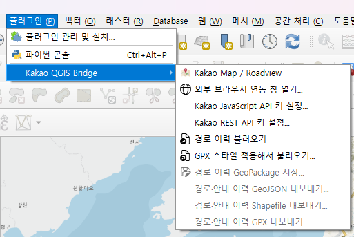

## Dock 기본 화면

QGIS 4 또는 Qt WebEngine을 사용할 수 있는 환경에서는 `Kakao Map / Roadview` Dock 안에서 Kakao Map, Roadview, 검색, 경로 탐색 UI가 함께 표시됩니다.

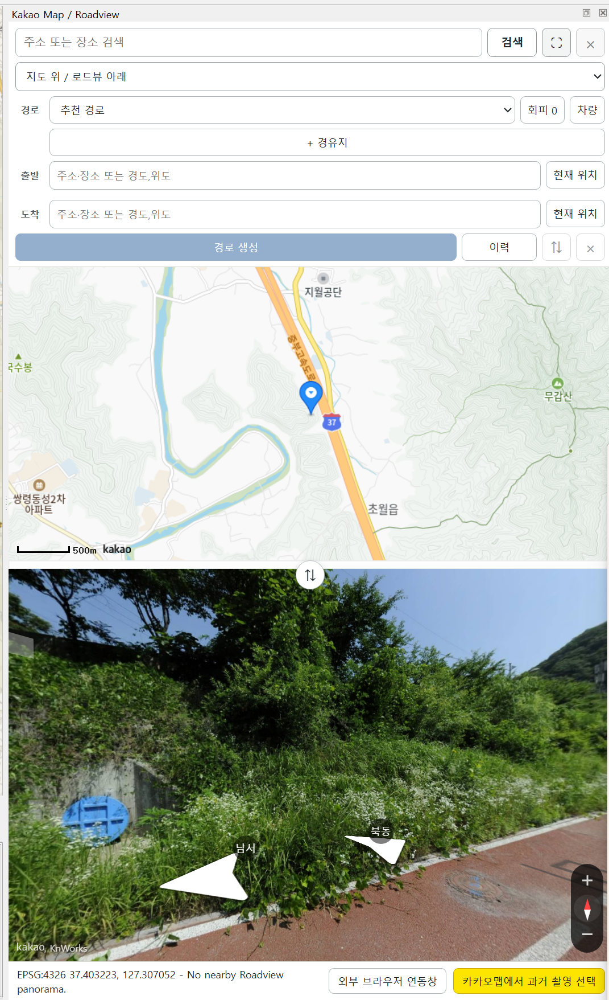

## 위치 동기화

QGIS 캔버스를 이동하면 중심 좌표가 EPSG:4326으로 변환되어 Kakao Map과 Roadview로 전달됩니다. 반대로 Kakao 지도 드래그 또는 Roadview 이동도 QGIS 캔버스에 반영됩니다.

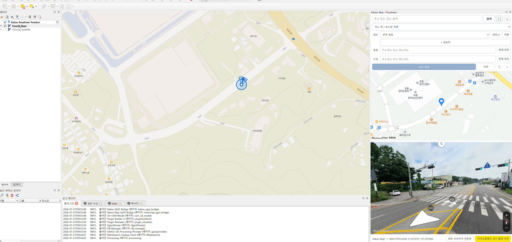

Roadview가 로드되면 현재 위치와 방향 정보가 상태바에 표시되고, QGIS의 `Kakao Roadview Position` 메모리 레이어도 갱신됩니다.

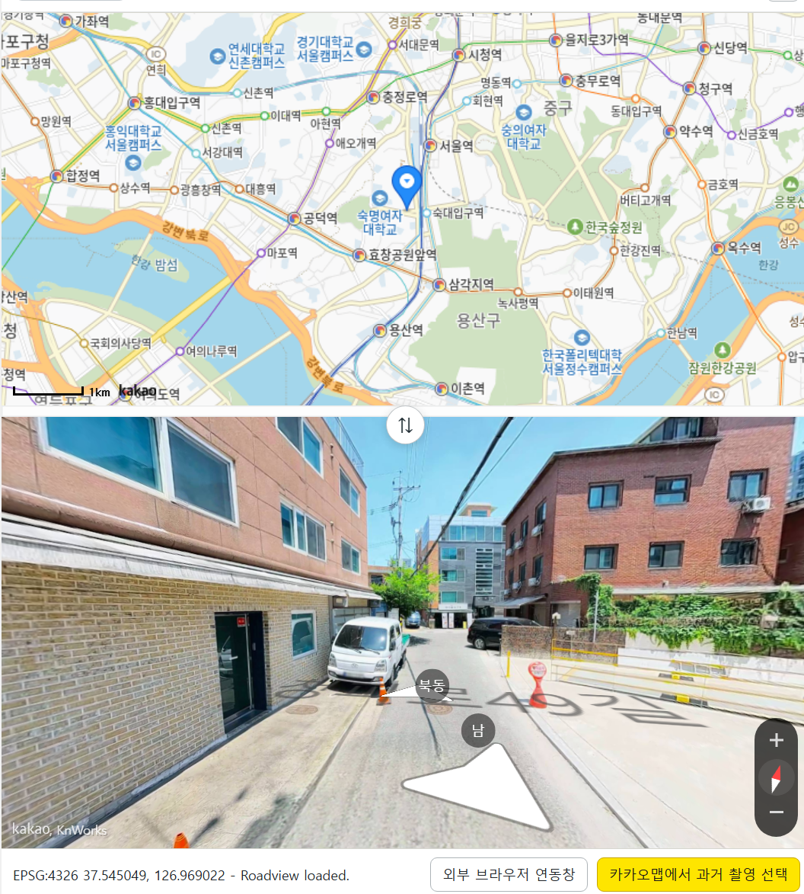

## 장소와 주소 검색

상단 검색창에서 장소명이나 주소를 입력하면 Kakao Local 검색 결과가 표시됩니다. 결과를 선택하면 Kakao Map, Roadview, QGIS 캔버스가 함께 이동합니다.

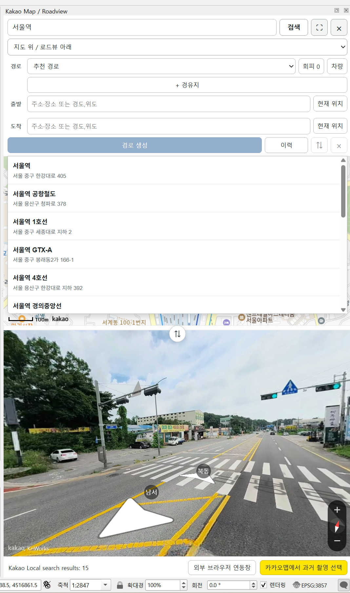

## 경로 입력

경로 입력 영역에서는 출발지, 도착지, 최대 5개 경유지, 경로 유형, 회피 옵션, 차량 설정을 지정할 수 있습니다.

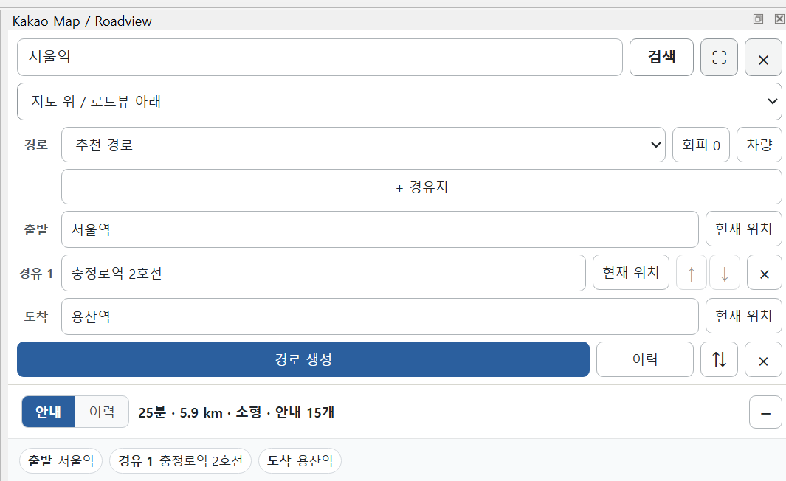

## 경로 결과

`경로 생성`을 실행하면 QGIS에 `Kakao Mobility Route`, `Kakao Route Points`, `Kakao Route Guidance` 임시 레이어가 생성됩니다. Dock에는 경로 요약과 순서별 안내 목록이 표시됩니다.

안내 목록의 항목을 선택하면 해당 안내 지점이 QGIS와 Kakao Viewer에서 함께 포커스됩니다.

## 경로 이력

생성한 경로는 현재 QGIS 세션 이력에 누적됩니다. 이력 탭에서 선택, 불러오기, 삭제, 내보내기 작업을 수행할 수 있습니다.

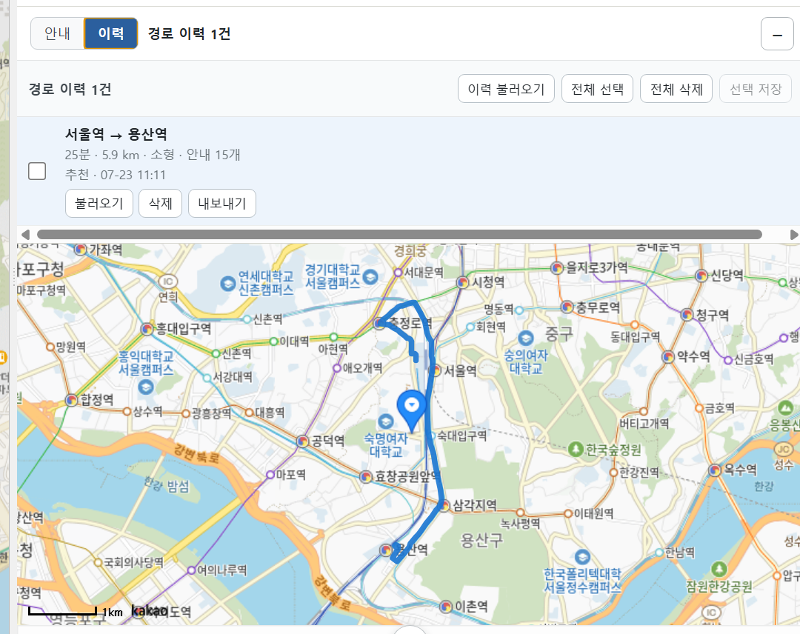

이력 내보내기는 전체 세션 또는 선택한 이력 1건을 대상으로 GeoPackage, GeoJSON, Shapefile, GPX 형식을 지원합니다.

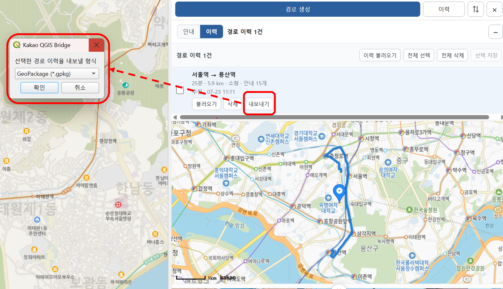

## GPX 스타일 적용 불러오기

GPX와 함께 생성된 QML 스타일 파일이 같은 폴더에 있으면 `GPX 스타일 적용해서 불러오기...` 메뉴로 트랙, 루트, 웨이포인트 레이어를 스타일과 함께 불러올 수 있습니다.

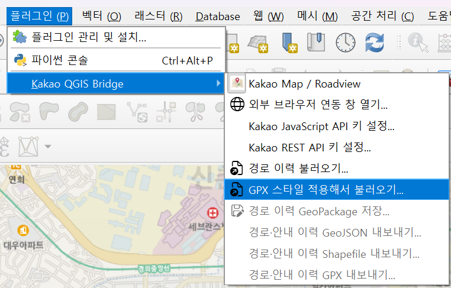

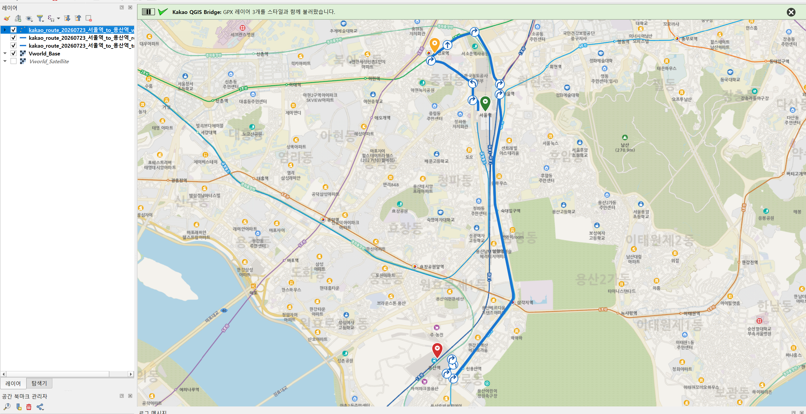

## 레이아웃과 전체화면

지도와 Roadview는 상하/좌우 배치로 전환할 수 있고, 분할선으로 영역 크기를 조절할 수 있습니다.

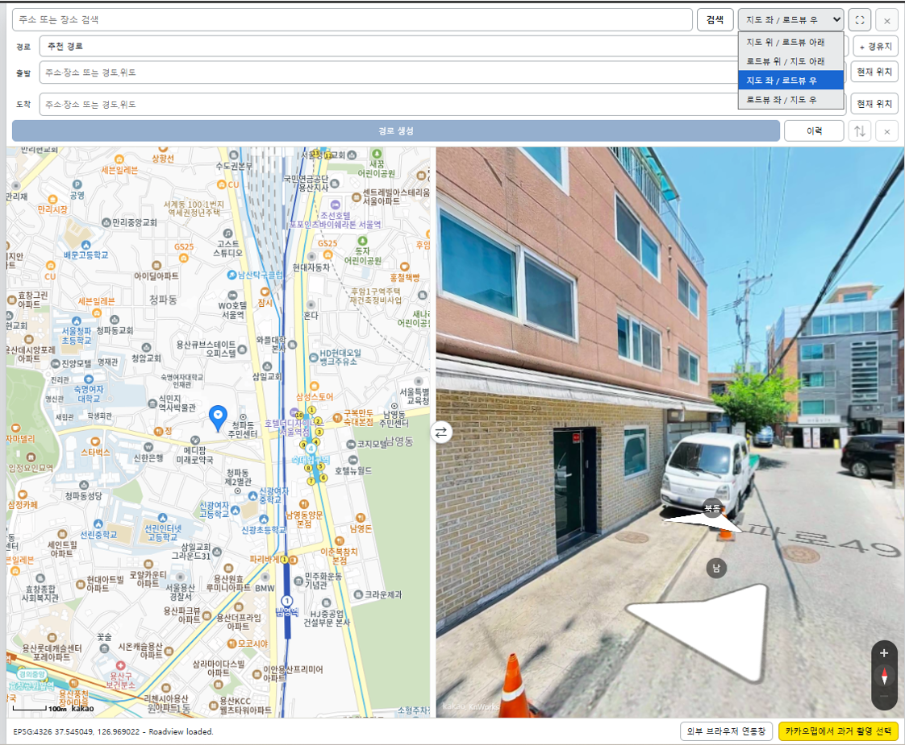

뷰어의 전체화면 버튼은 QGIS Dock 모드와 외부 브라우저 모드에서 각각 전체화면 전환에 사용됩니다.

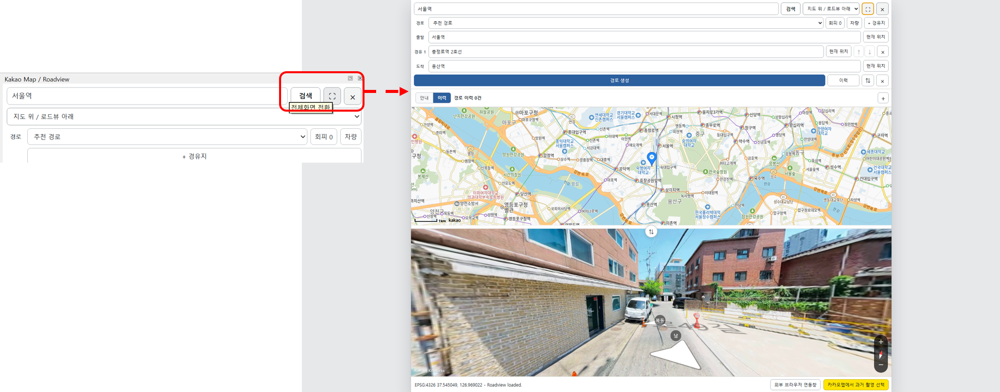

## 외부 브라우저 연동

QGIS 3에서 Qt WebEngine을 사용할 수 없거나 별도 브라우저 창이 필요한 경우 `외부 브라우저 연동 창 열기...` 또는 Dock 하단의 `외부 브라우저 연동창` 버튼을 사용합니다. 외부 Viewer는 `http://localhost:8081/`의 로컬 브리지 API를 통해 QGIS와 동기화됩니다.

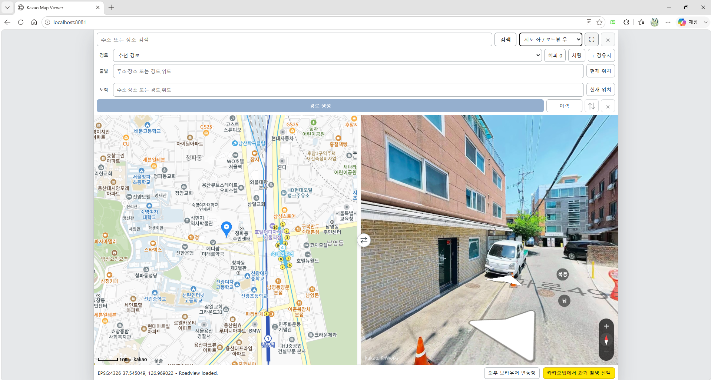
